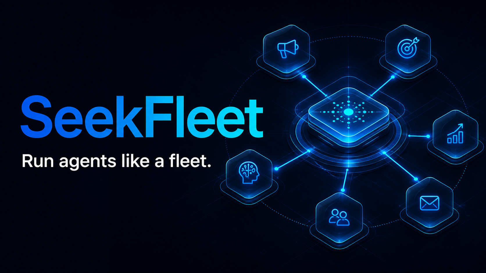

<div align="center">



# SeekFleet

### Run agents like a fleet.

Cross-platform control plane for DeepSeek Harness agent fleets — with MCP, durable sessions, adaptive routing, policy gates, token budgets, and a phone-friendly LAN dashboard.

<p>
  <a href="https://cndoin.github.io/seekfleet/">Live product page</a> ·
  <a href="./INSTALL.md">AI installation contract</a> ·
  <a href="./SKILL.md">Agent Skill</a> ·
  <a href="./SECURITY.md">Security</a>
</p>

<p>
  <a href="https://github.com/cndoin/seekfleet/actions/workflows/ci.yml"></a>
  <a href="https://github.com/cndoin/seekfleet/blob/main/LICENSE"></a>
  <a href="https://nodejs.org/"></a>
  <a href="https://github.com/cndoin/seekfleet/commits/main"></a>
</p>

</div>

> Give an AI the repository URL. It can install the Skill, configure MCP, verify the runtime, and explain exactly what changed.

## International overview

The product page includes a persistent language switcher with five localized experiences: [简体中文](https://cndoin.github.io/seekfleet/?lang=zh-CN), [English](https://cndoin.github.io/seekfleet/?lang=en), [日本語](https://cndoin.github.io/seekfleet/?lang=ja), [한국어](https://cndoin.github.io/seekfleet/?lang=ko), and [Español](https://cndoin.github.io/seekfleet/?lang=es). The page detects the browser language automatically, accepts a direct `?lang=` link, and remembers the visitor's choice.

| Language | Product summary |
| --- | --- |
| 简体中文 | 面向 DeepSeek Harness Agent 集群的跨平台控制平面，统一调度、监控、预算、策略与局域网控制台。 |
| English | A cross-platform control plane for routing, observing, budgeting, governing, and stopping DeepSeek Harness agent fleets. |
| 日本語 | DeepSeek Harness Agent艦隊をルーティング、監視、予算管理、制御するクロスプラットフォーム基盤。 |
| 한국어 | DeepSeek Harness 에이전트 함대를 라우팅, 관찰, 예산 관리, 정책 적용, 중지하는 크로스 플랫폼 제어 플레인. |
| Español | Un plano de control multiplataforma para enrutar, observar, presupuestar, gobernar y detener flotas de agentes DeepSeek Harness. |

## The 30-second version

SeekFleet turns DeepSeek Harness from a collection of processes into an observable, governable fleet:

| Surface | What it gives you |
| --- | --- |
| **MCP server** | 20 structured tools with stable envelopes and annotations |
| **SDK** | One TypeScript API for one-shot tasks, sessions, clusters, and DAGs |
| **Control plane** | Routing, cache, circuit breakers, budgets, policies, and cancellation |
| **LAN dashboard** | Live agents, requests, tokens, cost, failures, sessions, and protected controls |
| **Agent Skill** | One deterministic install path for Codex, Claude, Cursor, Gemini, and `.agents` clients |

## Give this repository to an AI

Copy this prompt as-is:

```text
Install SeekFleet from https://github.com/cndoin/seekfleet.
Read INSTALL.md first, install it for this AI client, configure its MCP server,
and verify the installation without exposing credentials.
```

The machine-readable contract lives in [INSTALL.md](./INSTALL.md). It includes Windows PowerShell, Linux, and macOS paths, user/project Skill scopes, verification, update, and rollback behavior.

## Install from source

Requirements: Node.js 20+, npm 10+, and `@deepseek-ai/dsh` or an explicit `DSH_MODULE_ROOT`.

```bash
git clone https://github.com/cndoin/seekfleet seekfleet
cd seekfleet
npm ci
npm run build
node dist/bin/seekfleet.js skill install --target auto
node dist/bin/seekfleet.js inspect
```

Install the Skill into every supported AI client:

```bash
node dist/bin/seekfleet.js skill install --target all --force
```

For a project-local Skill, use `--scope project`; it installs into `.agents/skills/seekfleet` without changing the user profile.

## Start the fleet

```bash
node dist/bin/seekfleet.js serve-mcp
```

Run MCP and the phone dashboard together on a trusted LAN:

```bash
node dist/bin/seekfleet.js serve-mcp \
  --dashboard \
  --dashboard-host 0.0.0.0 \
  --dashboard-port 8787
```

Open the printed URL on a phone connected to the same network. The dashboard is bearer-token protected; do not expose it directly to the public internet.

## SDK at a glance

```ts
import { SeekFleet } from "seekfleet";

const fleet = new SeekFleet();

const review = await fleet.run("Review this module for race conditions");
console.log(review.answer);

const clusterId = fleet.cluster({
  routing: "adaptive",
  instances: [
    { label: "code-a", tags: ["code"] },
    { label: "code-b", tags: ["code"] },
    { label: "review", tags: ["review"] },
  ],
});

const result = await fleet.clusterRoute(clusterId, {
  task: "Audit the authentication flow",
  tags: ["review"],
  timeoutMs: 120_000,
});

await fleet.clusterShutdown(clusterId);
```

`DshPlugin` remains available as a deprecated source-compatibility alias. MCP tool names retain the `dsh_*` prefix so existing integrations keep working.

## Choose your execution mode

| Mode | Best for | Control surface |
| --- | --- | --- |
| One-shot | One bounded task | `dsh_run` |
| Session | Long-running, cancellable work | `dsh_session_*` |
| Cluster | Parallel or repeated tasks | `dsh_cluster_*` |
| DAG | Dependent task graphs | `dsh_dag_run` |

Routing strategies include `least-loaded`, `round-robin`, `tag`, `adaptive`, and `random`.

## Making many agents behave like one organization

Splitting work across agents is lossy: every hand-off can only lose information,
never add it (data-processing inequality). Under an equal thinking-token budget a
single agent is often **not worse** than a fleet (Tran & Kiela, arXiv:2604.02460).
Fan out for throughput, isolation or breadth — not because "more agents" sounds
stronger.

When you do fan out, most failures come from organization design, not model
quality. In *Why Do Multi-Agent LLM Systems Fail?* (arXiv:2503.13657) the
annotated failures split into **system design 44.2%**, **inter-agent mismatch
32.3%**, and **task verification ~23%**. SeekFleet ships three mechanisms aimed
at exactly those buckets:

| Mechanism | What you pass | What it prevents |
| --- | --- | --- |
| **Role contract** | `role: "planner" \| "worker" \| "reviewer" \| "synthesizer"` or a full `RoleSpec` | Forgotten termination conditions, out-of-scope tools, runaway retry loops, unstructured hand-offs |
| **Independent verification** | `verify: [{ kind: "command", argv: [...] }, ...]` | "Done" declarations that nobody checked; every check runs as argv with `shell: false` |
| **Failure attribution** | nothing — always on | Flying blind: failures repeat because nobody knows which mode they hit |

A contract violation becomes a **failure** (`error.code:
"ROLE_CONTRACT_VIOLATION"` / `"VERIFY_FAILED"`), not a warning, and a run that
failed its contract is never written to the result cache.

```js
import { SeekFleet } from "seekfleet";

const fleet = new SeekFleet({});
const id = fleet.cluster({ instances: [{ label: "w1" }, { label: "w2" }], maxParallelSubtasks: 3 });

const plan = await fleet.clusterRoute(id, {
  task: "拆一个可并行的最小任务列表",
  role: "planner",            // 契约注入 prompt 并事后审计
  effort: "low",              // effort 档位决定并行度，不让简单问题炸开
});
console.log(plan.audit?.role?.parsedOutput);  // { subtasks: [{ id, goal, acceptance }] }

const done = await fleet.clusterRoute(id, {
  task: "实现 subtask-1",
  role: "worker",
  verify: [{ kind: "command", argv: ["npm", "test"], timeoutMs: 300000 }],
});
console.log(done.error?.code);   // VERIFY_FAILED if the tests fail

// 失败时不要只盯着 message —— 先问这次命中了哪一种失败模式
console.log(done.audit?.attribution?.primary?.code);   // e.g. FM-3.2
console.log(fleet.clusterStatus(id).attribution);      // 批量分布 + 对照 MAST 基准
```

MCP callers get the same values through `dsh_trace_classify`
(single trace → ranked signals with evidence) and `dsh_cluster_attribution`
(roll-up per cluster). See `examples/orchestration-departments.mjs` for the
full planner → workers → reviewer loop.

## Architecture

```text
AI client (Codex / Claude / Cursor / Gemini / Hermes / OpenClaw)
                              │
                         MCP or SDK
                              │
                         SeekFleet
          ┌───────────────────┼───────────────────┐
          │                   │                   │
    Durable sessions     Agent clusters      Policy gate
          │          routing · cache · DAG         │
          └───────────────────┼───────────────────┘
                              │
                     DeepSeek Harness
                              │
                tools · models · subprocesses
```

## Cross-platform configuration

PowerShell:

```powershell
$env:DSH_MODULE_ROOT = "C:\Tools\deepseek-harness"
$env:DSH_HOME = "$env:USERPROFILE\.dsh"
npm run serve-lan
```

Bash or zsh:

```bash
export DSH_MODULE_ROOT=/opt/deepseek-harness
export DSH_HOME="$HOME/.dsh"
npm run serve-lan
```

Use OS-native absolute paths. Do not copy Windows drive paths into Linux or macOS configuration.

## Environment variables

| Variable | Default | Purpose |
| --- | --- | --- |
| `DSH_MODULE_ROOT` | auto-detected | Installed DeepSeek Harness package |
| `DSH_HOME` | `~/.dsh` | Profiles and persistent runtime state |
| `CODEX_HOME` | `~/.codex` | Codex configuration root |
| `SEEKFLEET_DASHBOARD` | `0` | Start the dashboard with MCP when set to `1` |
| `SEEKFLEET_DASHBOARD_HOST` | `127.0.0.1` | Dashboard bind host |
| `SEEKFLEET_DASHBOARD_PORT` | `8787` | Dashboard TCP port |
| `SEEKFLEET_DASHBOARD_TOKEN` | random | Fixed dashboard bearer token |

The previous `DSH_DASHBOARD*` names remain accepted as compatibility aliases.

## Project map

- [`src/`](./src/) — SDK, routing, sessions, policies, metrics, dashboard, and MCP server
- [`bin/seekfleet.ts`](./bin/seekfleet.ts) — cross-platform CLI entry point
- [`SKILL.md`](./SKILL.md) — compact AI operating instructions
- [`agents/openai.yaml`](./agents/openai.yaml) — AI client discovery metadata
- [`docs/`](./docs/) — GitHub Pages product site and social preview asset
- [`examples/`](./examples/) — MCP, SDK, adapter, and cluster examples
- [`tests/`](./tests/) — 133 behavior and integration tests

## Development

```bash
npm ci
npm run format:check
npm run typecheck
npm run lint
npm test
npm run build
```

CI runs on Windows, Ubuntu, and macOS with Node.js 20, 22, and 24. The live product page is published from [`docs/`](./docs/) by [GitHub Pages](https://github.com/cndoin/seekfleet/actions/workflows/pages.yml).

## Security

SeekFleet executes real agent tools and subprocesses. Configure policies, budgets, finite timeouts, and restricted workspaces before autonomous use. See [SECURITY.md](./SECURITY.md) for the threat model and disclosure process.

## License

MIT — see [LICENSE](./LICENSE).
